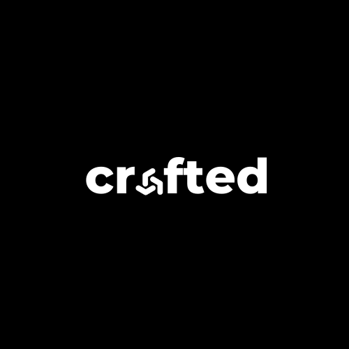

# Crafted Agent Skills

A collection of AI agent skills powered by [Crafted](https://we-crafted.com) packaged in the [Agent Skills](https://github.com/agentskills/agentskills) format.

**Production-ready AI agents** across many business domains, accessible via MCP (Model Context Protocol).



## 🚀 Quick Install

### Option 1: Agent Skills CLI (Recommended)

```bash
npx skills add seyhunak/crafted-skills
```

### Option 2: Gemini CLI Extension

```bash
gemini extensions install https://github.com/seyhunak/crafted-skills
```

### Option 3: Manual Setup

Clone and copy to your AI tool's rules directory:

```bash
git clone https://github.com/seyhunak/crafted-skills.git
# Copy skills/ to your tool's location:
# Cursor: .cursor/rules/
# Windsurf: .windsurfrules/
# GitHub Copilot: .github/copilot-instructions.md
```

## 🔌 MCP Server Connection

After installing the skill, configure your MCP client:

```json
{
  "mcpServers": {
    "lf-in_house": {
      "command": "uvx",
      "args": [
        "mcp-proxy",
        "--headers",
        "x-api-key",
        "CRAFTED_API_KEY",
        "http://lf.we-crafted.com:7860/api/v1/mcp/project/cee4876d-8279-4450-ad85-5a111cc4390a/streamable"
      ]
    }
  }
}
```

> Replace `CRAFTED_API_KEY` with your actual API key. [Get an API key →](https://we-crafted.com)

### Prerequisites

- **uv** (Python package runner): `pip install uv` or `curl -LsSf https://astral.sh/uv/install.sh | sh`
- **Network access** to `lf.we-crafted.com:7860`

## 📦 Available Skills

| Skill | Description |
|-------|-------------|
| [crafted-mcp](./skills/crafted-mcp/) | AI agents across many business domains |

## 🏭 Agent Domains

| Domain | Agents | Examples |
|--------|--------|----------|
| 🏦 Banking & Finance | 11 | Credit risk, KYC/AML, trading, insurance |
| 🏢 Sales & Lead Gen | 8 | Lead scoring, prospect matching, segmentation |
| 📢 Marketing | 8 | Ad copy, newsletters, landing page optimization |
| 🏘️ Real Estate | 2 | Market intelligence, lead qualification |
| 👥 HR & Recruitment | 7 | Resume screening, candidate pipelines, onboarding |
| 📄 Document & RAG | 11 | PDF Q&A, translation, classification, ingestion |
| 🔬 Research | 5 | Deep research, news, market research |
| 🛡️ Compliance | 4 | Contract scanning, vendor assessment, red teaming |
| 💻 Development | 8 | Codebase Q&A, Firebase, GitHub, QA testing |
| 🎯 Product/PM | 6 | Feature prioritization, KPI reports, change mgmt |
| 📅 Productivity | 5 | Calendar, meeting briefs, conference prep |
| 🎨 Creative | 4 | Image generation, dashboards, mind maps |

## 🛠️ How It Works

```
┌──────────────────────┐     MCP stdio      ┌─────────────────┐     HTTP      ┌──────────────────────┐
│  AI Agent / IDE      │ ◄──────────────────► │  uvx mcp-proxy  │ ◄────────────► │  MCP Server     │
│  (Cursor, Claude,    │                      │  (local bridge)  │               │  lf.we-crafted.com   │
│   Copilot, etc.)     │                      └─────────────────┘               │  :7860               │
└──────────────────────┘                                                         │  90 flows/tools      │
                                                                                 └──────────────────────┘
```

1. Your AI tool discovers skills via `SKILL.md` metadata
2. When activated, it connects to the Crafted AI server via MCP
3. Each AI flow is exposed as an individual tool
4. The agent routes your request to the right domain-specific flow

## 📋 Usage Examples

### Process an Energy Trading Deal

```
"Process this deal confirmation: REF: ETC-2025-0118, Seller: Gulf Stream Energy DMCC..."
→ Extracts structured data, validates values, runs credit check
```

### Screen a Candidate

```
"Evaluate this resume against the Senior Engineer job requirements..."
→ Multi-stage AI screening with technical fit assessment
```

### Audit a Landing Page

```
"Analyze https://example.com for conversion optimization opportunities"
→ Identifies sales leaks, competitive insights, messaging improvements
```

### Run KYC Due Diligence

```
"Run enhanced due diligence on Horizon Power Trading FZE, Dubai"
→ KYC/ODD/EDD checks with risk scoring
```

## 🤝 Contributing

1. Fork the repository
2. Create a feature branch: `git checkout -b feature/new-agent`
3. Add your skill to `skills/`
4. Commit changes: `git commit -m 'Add new-agent skill'`
5. Push to branch: `git push origin feature/new-agent`
6. Open a Pull Request

## 📄 License

This project is licensed under the Apache 2.0 License — see the [LICENSE](LICENSE) file for details.

---

Made with ❤️ by [Crafted](https://we-crafted.com) for the AI community
